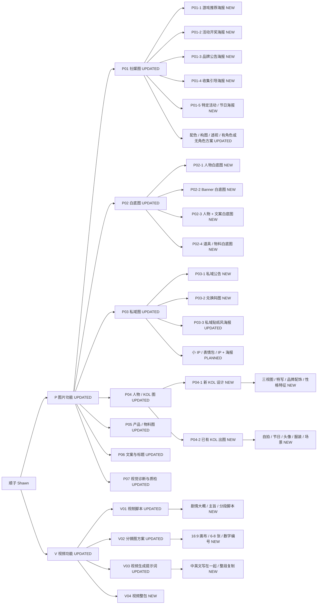

# 顺子功能树

这份文档给维护者和审核者看。它是功能编号的树状图，后续新增功能时优先更新这里。

标注说明：

- `NEW`：本版新增
- `UPDATED`：本版重点调整
- `PLANNED`：预留，暂不作为稳定功能

## 功能树

## 本版重点更新

- 图片和视频分成 `P / V` 两个大类。
- 子类编号从 `P01.01` 改成 `P01-1`，减少输入负担。
- 顺子支持自动识别，不写编号也能判断。
- 视频分镜图规则固定：16:9 画布、6/8 张画面、只用数字编号。
- TG、公盘、提示词网站增加同步包，不直接改机器人归档逻辑。
